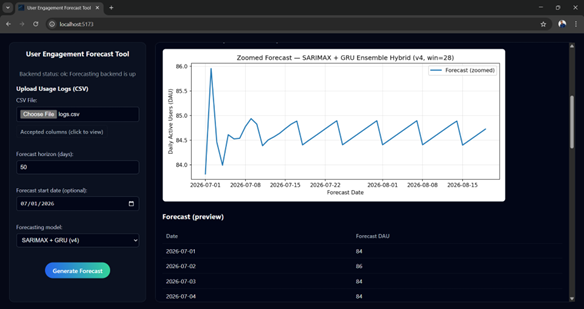
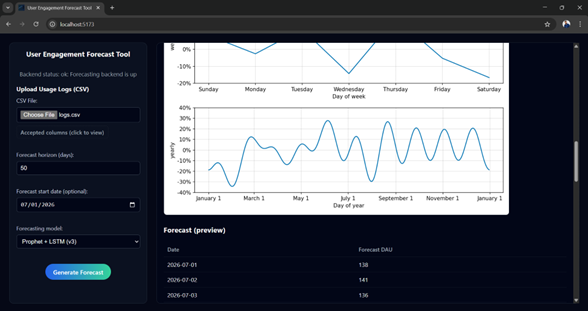

# User Engagement Forecasting for Python Software Applications

### Hybrid Time-Series Deep Learning Research Project

A research-based machine learning system that predicts **future user engagement in Python software applications** using application usage logs and hybrid time-series forecasting models.

This project was developed as a **4th Year Research Project** in the BSc (Hons) Software Engineering program, Faculty of Computing, Sabaragamuwa University of Sri Lanka.

---

## 📖 Research Background

Understanding how users interact with software is important for usability improvement, user retention, and product planning. However, most analytics systems only analyze past usage and cannot predict future engagement.

Python applications generate detailed usage logs such as timestamps, session counts, feature interactions, and downloads. Traditional analytics methods struggle to capture temporal dependencies and irregular usage patterns such as release spikes and academic-period activity. 

This research addresses that gap by building a **time-series forecasting framework** that predicts future engagement using machine learning and deep learning models. 

---

## 🎯 Objectives

* Predict future user engagement using application usage logs
* Compare statistical, deep learning, and hybrid forecasting models
* Handle irregular, sparse, and bursty user activity patterns
* Incorporate contextual variables such as feature updates and release cycles
* Develop a usable forecasting tool for software developers

---

## 🧠 Forecasting Approach

The study evaluates three categories of models:

### 1. Statistical Models

* ARIMA
* SARIMA
* Prophet

Used to capture linear trends and seasonality.

### 2. Deep Learning Models

* LSTM (Long Short-Term Memory)
* GRU (Gated Recurrent Unit)

Used to model nonlinear and long-term dependencies.

### 3. Hybrid Models (Proposed Solution)

* Prophet + LSTM
* SARIMAX + GRU
* Prophet + ElasticNet

Hybrid models combine trend decomposition and residual learning to improve prediction accuracy.

---

## 📊 Key Findings

Hybrid models significantly outperformed both statistical and deep learning approaches.

| Model          | Accuracy   |
| -------------- | ---------- |
| Prophet + LSTM | **93.65%** |
| SARIMAX + GRU  | **91.47%** |
| ARIMA          | 87.66%     |
| LSTM           | 65.10%     |
| SARIMA         | 52.16%     |

Hybrid models achieved the lowest prediction error (MAPE 6.35%), showing they are best suited for irregular and bursty software usage patterns. 

---

## 🧩 Features

* Upload application usage logs (CSV)
* Automatic preprocessing & feature engineering
* Model training and prediction
* Forecast visualization graphs
* Engagement trend analysis
* Developer decision support

The tool allows developers to upload logs and view predicted engagement values through visual dashboards. 

---

## 🏗️ System Architecture

```
Usage Logs (CSV)
        ↓
Data Preprocessing & Feature Engineering
        ↓
Forecasting Models (ARIMA / LSTM / Hybrid)
        ↓
Prediction Engine
        ↓
Visualization Dashboard
        ↓
Engagement Forecast
```

---

## 🛠️ Technology Stack

### Machine Learning

* Python
* TensorFlow
* Prophet
* Scikit-learn
* Statsmodels

### Backend

* Django
* FastAPI / REST API

### Frontend

* React (Vite)

### Data Processing

* Pandas
* NumPy
* Matplotlib / Visualization

---

## 📂 Dataset

Due to GitHub storage and security policies, datasets are **not included** in this repository.

The datasets consist of Python application usage logs including:

* Daily Active Users
* Session count
* Download count
* Feature usage
* Error count
* Release flags
* Calendar variables

(Provide your Google Drive link here)

---

## ⚙️ Installation

### 1. Clone repository

```bash
git clone https://github.com/yourusername/4th-Year-Research-Project.git
cd 4th-Year-Research-Project
```

### 2. Create virtual environment

```bash
python -m venv venv
venv\Scripts\activate
```

### 3. Install dependencies

```bash
pip install -r requirements.txt
```

### 4. Run backend

```bash
python manage.py runserver
```

### 5. Run frontend

```bash
cd frontend
npm install
npm run dev
```

---

## 📈 Evaluation Metrics

The models were evaluated using:

* MAE (Mean Absolute Error)
* RMSE (Root Mean Squared Error)
* MAPE (Mean Absolute Percentage Error)

These metrics were tested under:

* Normal usage
* Sparse usage
* Bursty usage scenarios 

---

## 📸 Screenshots & System Diagrams

### 🧩 Research Questions & Objectives


This diagram summarizes the core research questions and objectives, including evaluation of statistical, deep learning, and hybrid forecasting models and the development of a practical forecasting tool for developers.

---

### 🧠 Forecasting Pipeline


The engagement prediction workflow begins with Python usage logs and contextual data, followed by feature engineering and time-series modeling (ARIMA, LSTM, and hybrid models) to generate Daily Active User (DAU) forecasts.

---

### 🔄 Research Methodology


The study follows a full machine learning lifecycle including data collection, preprocessing, feature engineering, model development, evaluation, and robustness testing.

---

### 📊 Forecasting Dashboard



Users upload log files and generate engagement predictions using hybrid forecasting models. The system visualizes predicted engagement trends and provides forecast tables.

---

### 🤖 Hybrid Model Forecast (Prophet-LSTM)



The interface allows selection of different models and displays time-series seasonal patterns and predicted engagement values.

---

### 📈 Model Performance Comparison


Performance comparison shows hybrid models outperform statistical and deep learning models, achieving the lowest prediction error and highest forecasting accuracy.


## 🚀 Future Work

* Real-time engagement prediction
* Explainable AI integration
* Multi-application forecasting
* Cloud deployment
* Automated monitoring dashboard

---

## 👨‍💻 Author

**V. Janarthan**
BSc (Hons) Software Engineering
Sabaragamuwa University of Sri Lanka

---

## 📄 Publications

* *Hybrid Deep Learning Models for Time Series Forecasting of User Engagement in Python Software Applications* 
* *Time Series Forecasting of User Engagement in Python Software Applications Based on Usage Logs* 

---

## 📜 License

This project is for academic and research purposes.
You may use or extend the work with proper citation.

---

⭐ If this research helps your work, please consider starring the repository.
